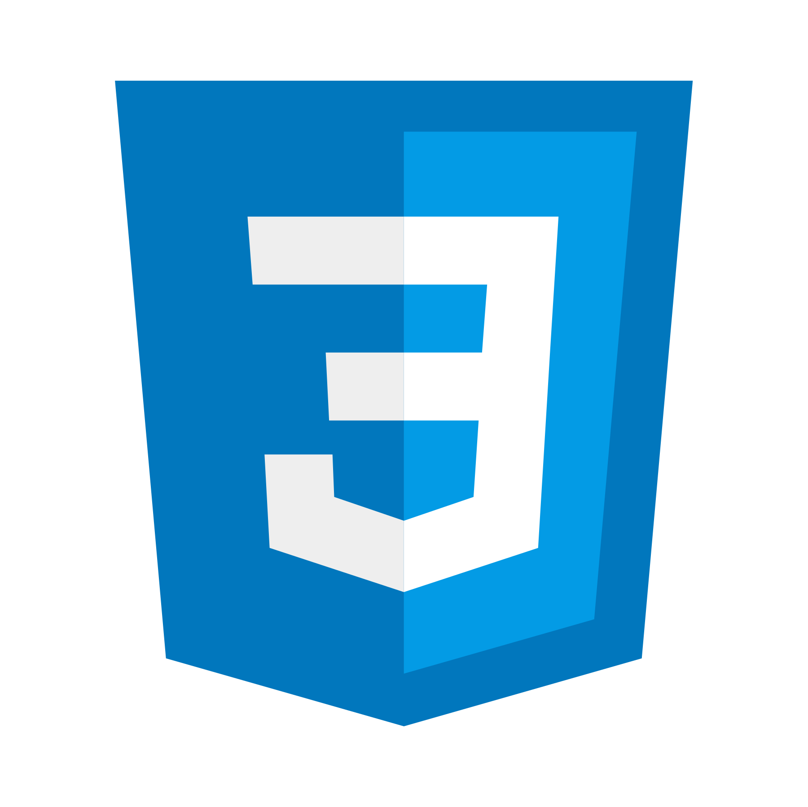
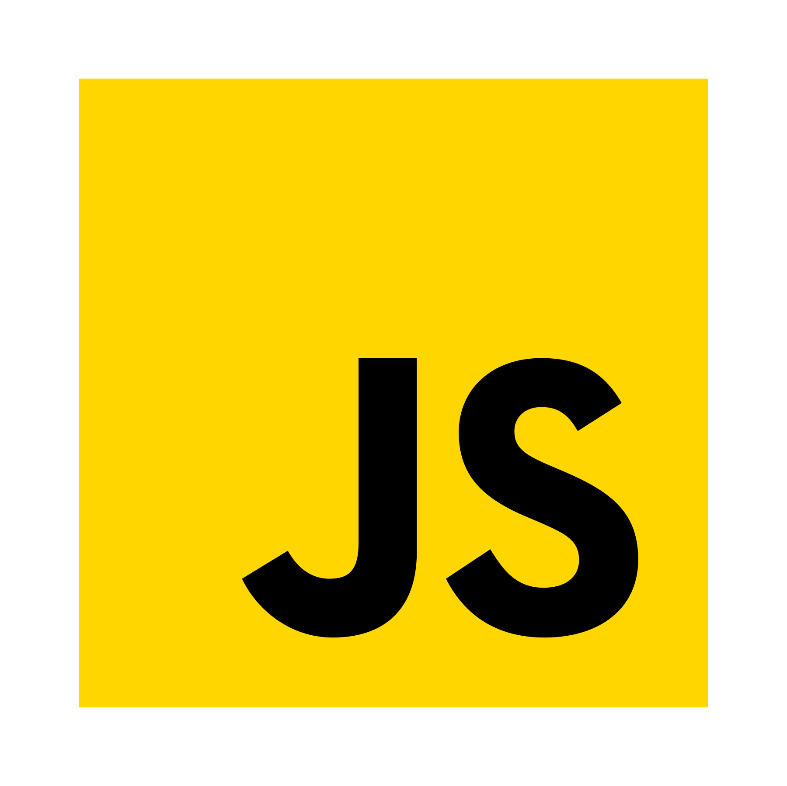
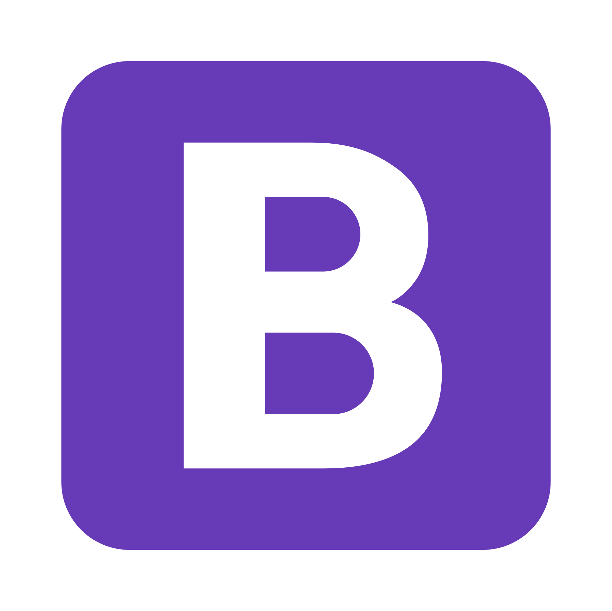
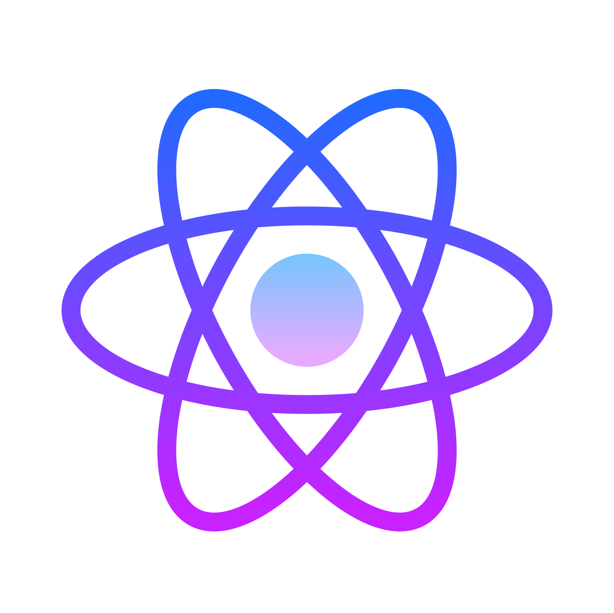
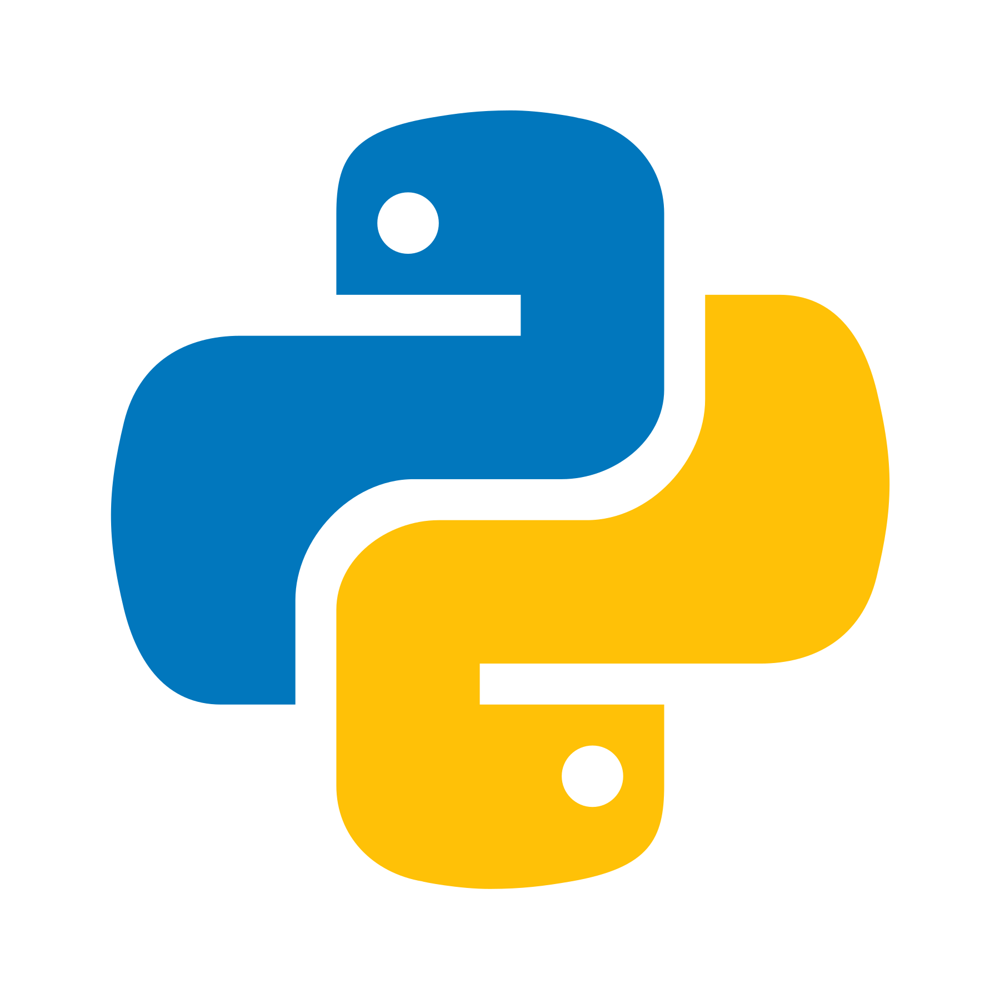
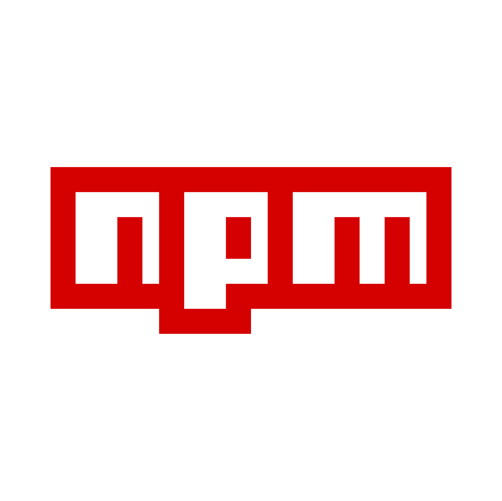
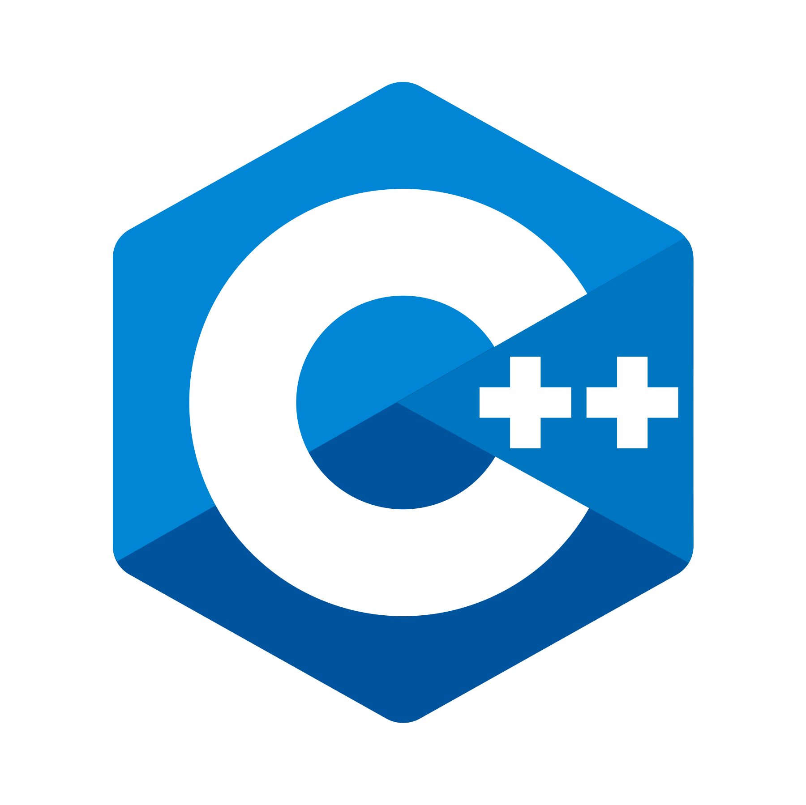

### Howdy, I am Kijana (Ka-john-a) and I code stuff 😅! ###

 

## I am an Animal Lover, Manga/Anime/Comics Geek, and I am a bit of runner. ##
- 💻 I am currently focusing on learning more about the "why" in a techstack.
- 📚 Presently, I am engaged in the application of diverse algorithmic methodologies.
- 👔 I am interested in hearing about new full-time opportunities.
- 🥷🏾 Random Fact: I am a currently training for a marathon!

 

## My Languages and Tools: ##
 
 
 

 

 

 
 

## Let's be internet friends! ##
[][linkedin]
[][codepen]
[][discord]

[linkedin]: https://www.linkedin.com/in/kijana-p-richmond/
[codepen]: https://codepen.io/accidental-feature
[discord]: https://discordapp.com/users/813521466510540811/](https://discord.gg/5Wj3VdRtRQ)https://discord.gg/5Wj3VdRtRQ
